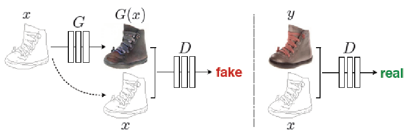
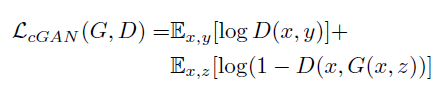
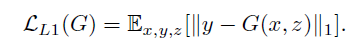
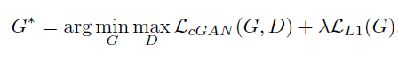
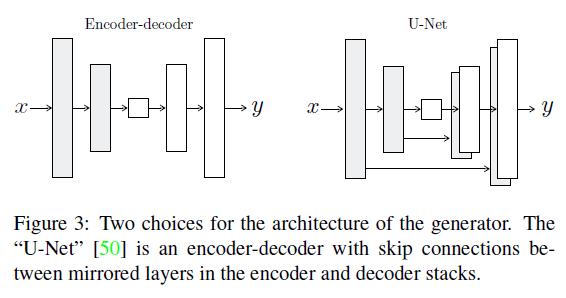
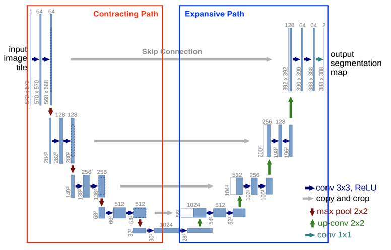
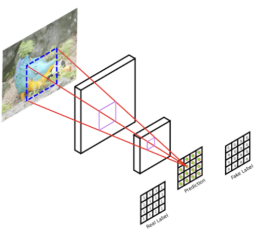

## Pix2Pix

#### YBIGTA 18기 남종현

## Basic

+ 대부분의 CNN방식에서 유클리디안 거리를 최소화 하는 쪽으로 진행
+ 나올 수 있는 결과의 평균을 취하는 쪽으로 진행하기 때문에 이미지가 선명하지 못함
+ pix2pix2는 GAN을 기반으로 진행하기 때문에 이러한 결과 방지



+ cGAN 기반
+ Input vector x와 noise vector z를 이용해 output 생성
+ Input image의 dist 정보도 real/fake를 구분하는 데 사용
+ dropout의 형식으로 noise 제공

## Objective





cGAN Loss(adversarial Loss) + L1 Loss(reconstruction Loss)

+ D는 real/fake를 구분하는 역할을 그대로 가짐
+ G는 D를 속이는 것 이외에 ground truth에 가까운 이미지를 생성해야함

### final objective



## Model architecture

+ DCGAN의 G와 D를 기본 모델로 했고, 각 layer는 conv-BatchNorm-ReLU 구조를 따름

### Generator



+ 이전의 연구들은 encoder-decoder Network를 사용
+ bottleneck를 통과하며 정보의 손실이 발생
+ 따라서 skip-connection을 추가한 U-Net 구조 사용

### U-Net



+ 전체 layer 수를 N이라고 할때, i번째와 N-i번째 layer를 연결
+ 각 연결은 단순히 concatenate
+ 처음 detail들이 마지막 layer까지 잘 전달 됨

+ Ck: conv-BatchNorm-ReLU layer
+ CDk: conv-BatchNorm-Dropout-ReLU layer with a dropout rate of 50%
+ All conv는 4x4 spatial filter, stride = 2
+ downsample, upsample by a factor 2

#### Generator layers

Encoder: C64-C128-C256-C512-C512-C512-C512-C512

U-Net decoder: CD512-CD1024-CD1024-C1024-C1024-C512-C256-C128

+ decoder의 마지막 layer 이후 Tanh 사용
+ encoder의 C64에서는 BatchNorm 적용 x
+ encoder의 ReLu는 leaky ReLU(slope=0.2), decoder는 ReLU 사용

### Discriminator



+ PatchGAN 사용
+ NxN patch를 사용하여 각 부분의 real/fake 판별
+ 전체 이미지를 연산하여 판별하는 것 보다 연산의 수가 적고 빠름
+ G는 각각의 이미지 patch 조각의 real/fake를 속이기 위해 학습과정 진행

### Discriminator layers

70x70 discriminator

C64-C128-C256-C512

+ 마지막 layer 이후 1-dim output return(sigmoid func)
+ 첫번째 layer에서 BatchNorm 적용 x
+ Leaky ReLU(slope = 0.2) 사용

## Train/Optimization

+ Train

Jittering: 256x256 이미지는 286x286 크기로 resize, random cropping을 통해
           256x256으로 변환

모든 네트워크는 scratch로부터 학습

weight는 Gaussian dist(0, 0.02)를 따르는 랜덤 초기값을 가짐

+ Optimization

일반적인 GAN 접근법을 따름

D를 최적화하는 Objective를 2로 나누어 D가 G보다 상대적으로 빠르게 학습되지 않도록 함

minibatch SGD, Adam(lr = 0.0002, beta = (0.5, 0.999) ) 사용

### Reference

https://arxiv.org/abs/1611.07004
https://greeksharifa.github.io/generative%20model/2019/04/07/Pix2Pix/
https://medium.com/humanscape-tech/paper-review-pix2pix-20418569e0c1
https://github.com/phillipi/pix2pix


```python

```
